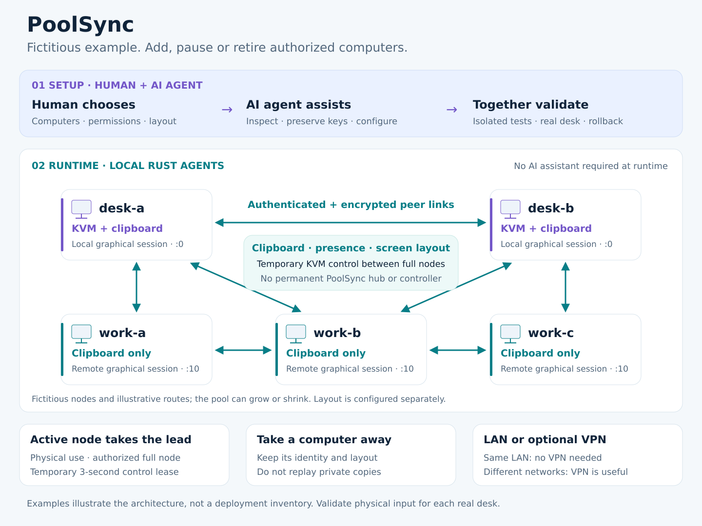

# PoolSync

PoolSync is installed and configured by a **human–AI agent tandem**. The human
chooses the computers, permissions, screen layout and remote-desktop clipboard
policy. The agent assists with building, configuration, reversible installation
and verification. The AI assistant is not required during normal operation.

PoolSync shares clipboard content and, on authorized computers, keyboard and
mouse control through direct encrypted Rust peers. No permanent PoolSync server
or indispensable computer is required in hubless mode. Physical use of an
authorized full-mode node can make it the controller; leadership is temporary,
not tied to a fixed server/client arrangement.



## Usage

- `full` nodes share clipboard content and can control keyboard/mouse.
- `clipboard_only` nodes share copies without taking KVM control.
- A temporarily absent node retains its identity and layout; private copies are
  not automatically replayed when it returns.
- On a reachable LAN, no VPN is necessary. Across networks or sites, a VPN can
  provide private routes. Peer identity and encryption still apply.
- Local recovery uses **Ctrl+Alt+Shift+M** on authorized KVM nodes.

Start with the [installation runbook](docs/AI-AGENT-INSTALLATION.md),
[configuration examples](docs/CONFIGURATION.md) and
[illustrative scenarios](docs/CONCEPT-AND-SCENARIOS.md). All example computer
names and addresses are fictitious.

## Build

Use a compatible Rust toolchain and the dependencies described in the runbook:

```sh
cargo test --locked --workspace
cargo clippy --locked --workspace --all-targets -- -D warnings
cargo build --locked --release -p poolsync-agent
```

The workspace also retains an optional legacy hub and web dashboard. They are
compatibility components; hubless peers do not require either component.

## Compatibility

The main desktop implementation uses X11/GTK. Wayland capture has additional
permission/backend limits. Native RDP clipboard redirection requires an explicit
policy and can interfere with clipboard ownership; see
[remote desktop compatibility](docs/REMOTE-DESKTOP.md). Source and unit tests do
not establish physical screen-edge behavior, monitor hotplug or daily stability
on every desktop. This is a development version, not a universal compatibility
or stability guarantee.

MIT license; see [LICENSE](LICENSE).
