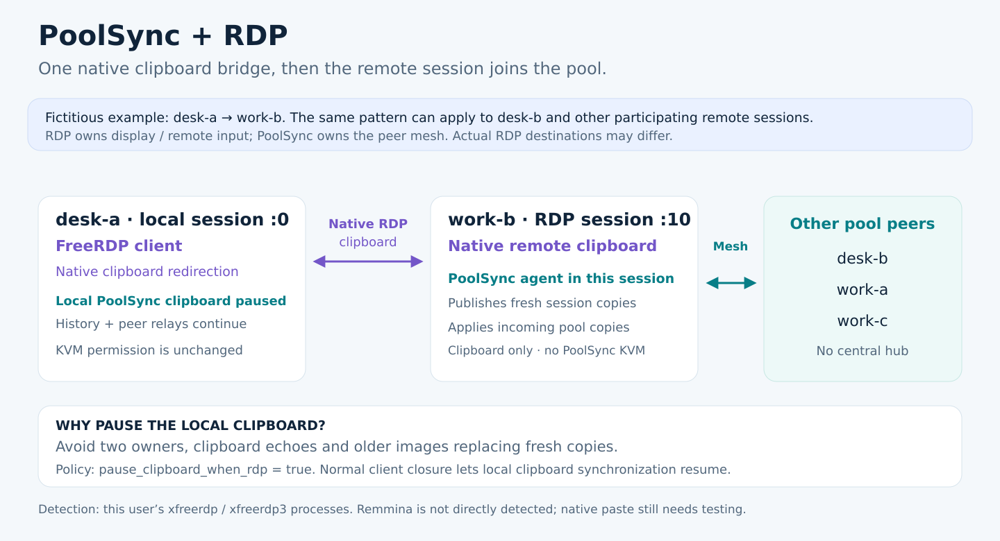

# Concept and scenarios

The human–AI tandem configures the pool. At runtime, authorized computers connect
directly and exchange encrypted clipboard data, presence, control and layout.
The controller is an input owner, not a permanent coordinator. Concurrent claims
use deterministic ordering and a renewable lease; loss of its owner expires the
claim. Only full-mode, present and authorized peers may take KVM control.

## Illustrative pool

| Fictitious computer | Role | Example use |
| --- | --- | --- |
| desk-a | full | Office keyboard/mouse and clipboard |
| desk-b | full | Adjacent desktop with a different resolution |
| work-a | clipboard_only | Remote graphical session |
| work-b | clipboard_only | Another workstation |
| work-c | clipboard_only | An additional graphical session |

This is an example, not a fixed five-computer requirement. Names, roles, routes
and layouts are configurable. Enrollment is explicit; discovering a computer on
a LAN does not authorize it to join.

## Changes during ordinary use

- Physically use desk-a, then desk-b: either eligible node can request leadership.
  Forwarded input alone does not make the receiving computer the controller.
- Add desk-c: enroll a distinct identity, authorize reciprocal peer routes and
  review its layout before enabling KVM. Requalify the enlarged pool.
- Take desk-b away temporarily: use the tray departure action or the agent's
  `--away true` command. Resume with `--away false`; keep the saved configuration.
- Retire work-c: remove its authorization, peer routes and layout entry
  coherently. Permanent retirement differs from temporary absence.
- Attach a monitor: compare real virtual-desktop bounds and the intended outer
  edges. Network reachability does not establish screen adjacency.

## Local and cross-site networks

A reachable LAN needs no VPN. Across different networks, a VPN can provide
private connectivity. Both arrangements still require peer authentication,
trusted TLS routes and encryption. No particular VPN product is required.
An ordinary peer may relay; a chain still depends on its usable network paths.
Provide alternate routes if losing a relay must not isolate another member.

## Remote graphical sessions

An RDP session carries its own display and input. A clipboard-only PoolSync agent
inside that session shares its copies without participating in screen-edge KVM.
Native RDP clipboard redirection is a separate transport. When enabled, the
local FreeRDP client's PoolSync clipboard path can pause to avoid competing with
it; the remote session's agent can distribute copies to the pool. When native
redirection is disabled, the local PoolSync path remains active. See the
[compatibility policy](REMOTE-DESKTOP.md).

Validate both physical crossing directions using each source's own devices,
destination typing, local recovery and monitor attachment/removal. Protocol
tests and generated input cannot substitute for these observations.
